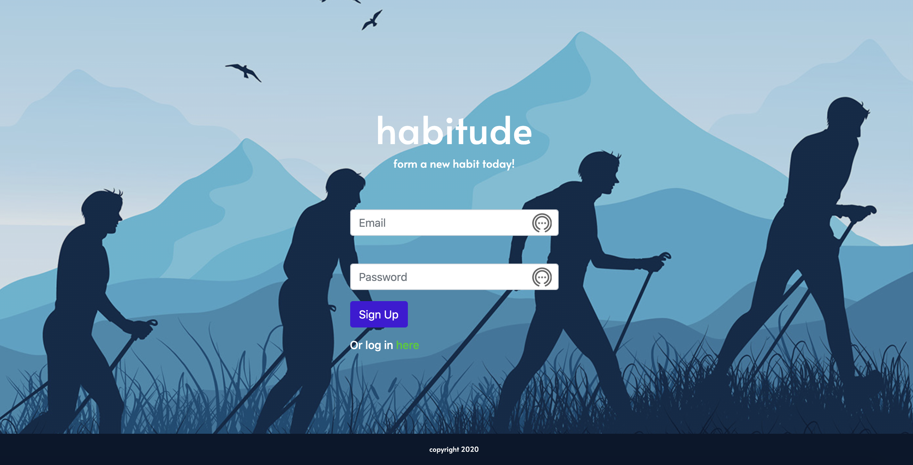

  
# habitude

## Table of Contents
* [Description](#description)
* [Installation](#installation)
* [Usage](#usage)
* [License](#license)
* [Contributors](#contributors)
* [Questions](#questions)

## Description
"How we spend our days is of course how we spend our lives." -Annie Dillard. Build a better life by keeping track of what you're doing each day. With Habitude, you can build new habits and see your progress over time. 

Every time you login, you can see your progress in charts, and update your your progress.

With habitude, you can choose which habits you want to build. Now you're a member of the growing community! 

## Installation Instructions
No installation instructions as of now.

## Usage Information
No usage instructions as of yet.

## License
MIT

## Contributors
Angel Alexander, Berhane Beyene, Andres Roldan, and Caroline Twyman

## Questions
Contact us:

Githubs: 
[carolinetwyman](https://github.com/carolinetwyman)
[dresroldan](https://github.com/dresroldan)
[Bbeyenene](https://github.com/Bbeyenene)
[analexander](https://github.com/analexander)

Emails: 
[carolinetwyman@gmail.com](carolinetwyman@gmail.com)
[dresroldan@gmail.com](dresroldan@gmail.com)
[monoxica2004@yahoo.com](monoxica2004@yahoo.com) 
[angale22@gmail.com](angale22@gmail.com)
