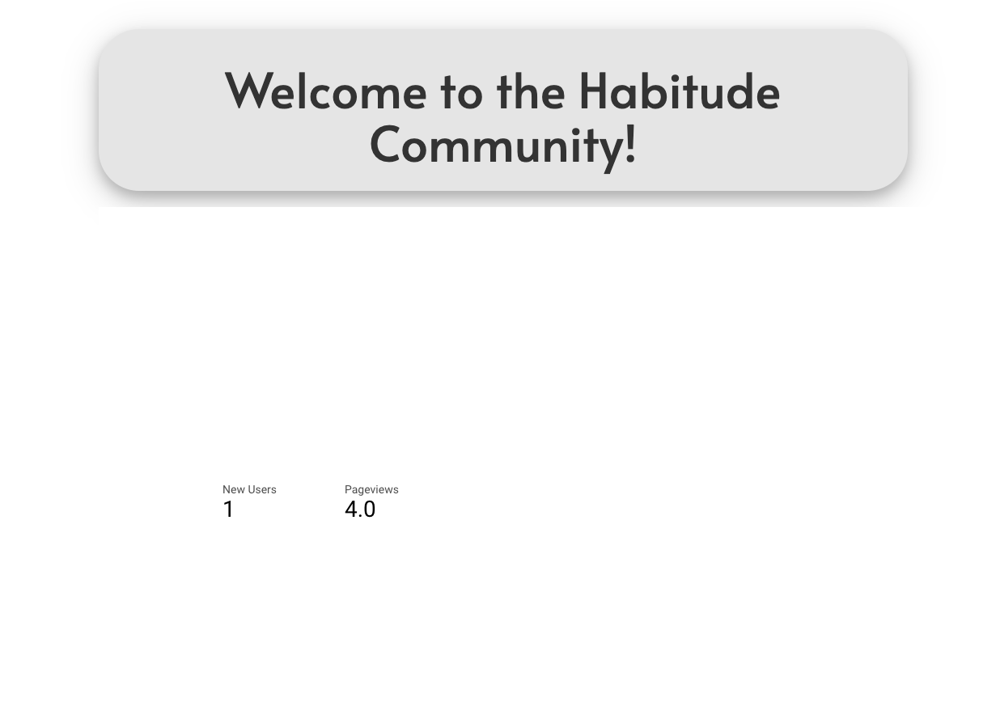
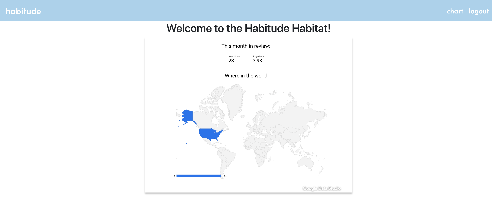
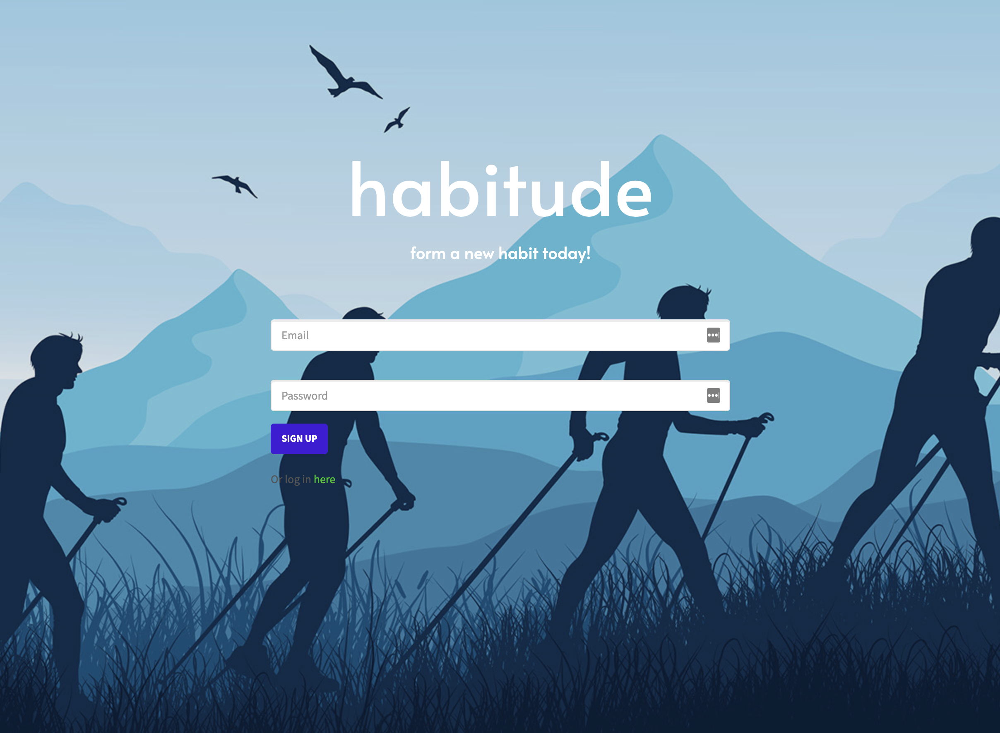
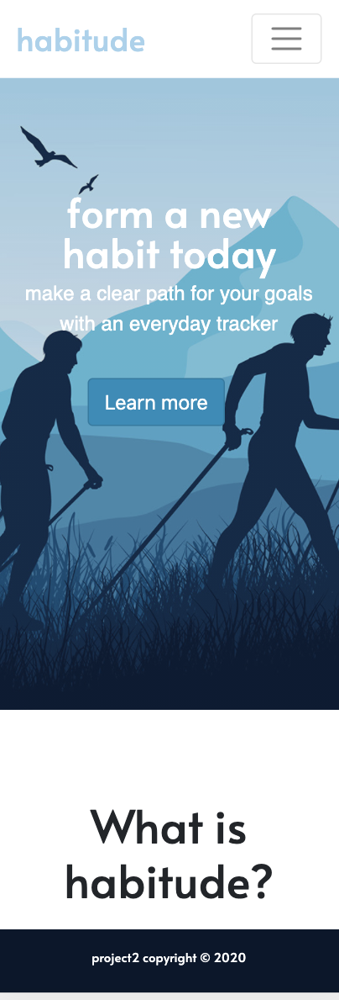

  
# habitude

## Table of Contents
* [Description](#description)
* [Installation](#installation-instructions)
* [Usage](#Usage-Information)
* [License](#license)
* [Contributors](#Contributors)
* [Questions](#questions)

## Description
"How we spend our days is of course how we spend our lives." -Annie Dillard. Build a better life by keeping track of what you're doing each day. With Habitude, you can build new habits and see your progress over time. 

Every time you login, you can see your progress in charts, and update your your progress. With habitude, you can choose which habits you want to build. Now you're a member of the growing community!

1. Signup page

2. Visitors analysis page

3. Activity goal setup page

4. certificate of completion

5. XS-mobile Screen Size

 

## Installation Instructions
No installation instructions as of now.

Link to URL: https://habitudeapp.herokuapp.com/
## Usage Information
1. Any one intersted to use habitude app must sign. 
2. User must login to track daily activities for the goals setup.
3. Setup your goals and then input your daily activity.
4. For every activity there is a chart that compare your daily goals and activitys.
5. Visit the comunity chart to view how popular habitude app is.
6. Click the Check Completion Certificate button to view your certificate of compliton.
7. You can login and out any time.

## License
.

## Contributors
Angel Alexander, Berhane Beyene, Andres Roldan, and Caroline Twyman

## Questions
Contact us:

Githubs: 
1. [carolinetwyman](https://github.com/carolinetwyman)
2. [dresroldan](https://github.com/dresroldan)
3. [Bbeyenene](https://github.com/Bbeyenene)
4. [analexander](https://github.com/analexander)

Emails: 
* [carolinetwyman@gmail.com](carolinetwyman@gmail.com)
* [dresroldan@gmail.com](dresroldan@gmail.com)
* [monoxica2004@yahoo.com](monoxica2004@yahoo.com) 
* [angale22@gmail.com](angale22@gmail.com)

